[⬅ Back to BoardGameGeek README](../../README.md)

# BoardGameGeek Corpus creation (`bgg_corpus`)

Here we build the **structured corpus of BoardGameGeek (BGG) reviews**, integrating both metadata and user reviews from **crawler and API sources**, with support for **review preprocessing, balancing, and corpus assembly**.

## ⚙️ Data Preparation

Before running the CLI to build the corpus, **you must first download the raw review data** using the provided downloaders.

### 1. Run the Downloaders Separately

The downloaders are designed to be **executed independently** from `cli.py`, ensuring that raw data is collected and stored before preprocessing or corpus construction begins.

You can run either or both:

```bash
# Fetch BGG reviews and metadata via crawler
python downloaders/bgg_crawler.py

# Fetch BGG reviews and metadata via API
python downloaders/bgg_api.py
```

Each downloader will automatically save its outputs in the following directories according to the specifications in `config.py`:

| Source     | Path                                                       | Format  |
| :--------- | :--------------------------------------------------------- | :------ |
| 🕷️ Crawler | [`BoardGeekGames-Corpus/data/crawler`](../../data/crawler) | `.json` |
| 🌐 API     | [`BoardGeekGames-Corpus/data/api`](../../data/api)         | `.json` |

> ⚠️ **Note:**
> The `.json` files produced here are later **merged and standardized** during corpus construction.
> Ensure that both directories contain the required data before proceeding.
>
> It is **mandatory** to:
>
> - Run **`bgg_crawler.py`** to collect review statistics such as
>   `total_all`, `total_commented`, `total_rated`, `total_rated_and_commented`, `avgweight`, `numweights`, `poll_avg`, and `poll_votes`.
> - Run **`bgg_api.py`** with the `--mode metadata` flag to retrieve full **game metadata**.
>
> For further details on the configuration, modes, and output formats, see the [**Downloaders README**](./downloaders/README.md).

Once this data is collected, you can proceed with the **CLI pipeline** (below) to build the full corpus.

## 1. Pipeline Summary

1. **Downloaders:** Extract raw reviews and metadata using the **crawler** or **API** (run separately).
2. **Utilities:** Merge reviews, load metadata, standardize text, and build corpus objects.
3. **Balancing:** Apply oversampling, undersampling, or hybrid strategies to handle rating imbalance.
4. **Preprocessing:** Clean, normalize, and label review text via `process_single_review()`.
5. **Corpus Assembly:** Construct hierarchical corpus objects ready for downstream analysis.

## 2. Modules Overview

| Module                                         | Purpose                                                      | Documentation                     |
| :--------------------------------------------- | :----------------------------------------------------------- | :-------------------------------- |
| **[downloaders](./downloaders/README.md)**     | Fetch reviews and metadata from BGG (crawler/API).           | [docs](./downloaders/README.md)   |
| **[utilities](./utilities/README.md)**         | Load/merge reviews, build metadata, and assemble corpus.     | [docs](./utilities/README.md)     |
| **[preprocessing](./preprocessing/README.md)** | Clean and normalize review text.                             | [docs](./preprocessing/README.md) |
| **[balancing](./balancing/README.md)**         | Balance review distribution by ratings.                      | [docs](./balancing/README.md)     |
| **[models](./models/README.md)**               | Define `Corpus`, `GameCorpus`, and `CorpusDocument` classes. | [docs](./models/README.md)        |
| **[features](./features/README.md)**           | Handle linguistic and vector representations.                | [docs](./features/README.md)      |
| **[storage](./storage/README.md)**             | Save and load corpora from MongoDB or disk.                  | [docs](./storage/README.md)       |

## 3. CLI Usage (`cli.py`)

Once the raw `.json` data is available in the `data/` folders, you can build the corpus using:

```bash
# Build corpus for games 50, 51, 52 with default settings
python cli.py --games 50 51 52 --save-json --generate-stats

# Build corpus using hybrid balance, enable augmentation
python cli.py --games 50 51 52 --balance-strategy hybrid --use-augmentation

# Use API-only reviews and disable parallel processing
python cli.py --games 50 51 52 --source api --no-parallel
```

**Key Options:**

| Option                         | Description                                           |
| :----------------------------- | :---------------------------------------------------- |
| `--games`                      | List of BGG game IDs                                  |
| `--source`                     | `"crawler"`, `"api"`, or `"combined"`                 |
| `--balance-strategy`           | `"oversample"`, `"undersample"`, `"hybrid"`           |
| `--use-augmentation`           | Enable text augmentation for underrepresented ratings |
| `--save-json` / `--save-mongo` | Save corpus as JSON or MongoDB                        |
| `--generate-stats`             | Save balancing statistics (post_creation)             |

### ## 4. Corpus Building Workflow

The `build_corpus()` function constructs the complete BGG review corpus in **three main phases**:

### **Phase 1 — Review Collection & Balancing**

- Merge reviews from API and/or crawler sources via `merge_reviews()`.
- Perform global multi-game balancing using `collect_balanced_reviews_multi_game()`.
  Supports three strategies: **oversample**, **undersample**, or **hybrid**.
- Optionally perform text augmentation for underrepresented classes.
- Save detailed balancing statistics through `save_balance_report()`.

### **Phase 2 — Parallel Preprocessing & Document Conversion**

- Standardize each review object with `ensure_review_obj()`.
- Preload spaCy language models in worker processes via `init_spacy_models()`.
- Use a single `ProcessPoolExecutor` to parallelize the conversion of raw reviews into `CorpusDocument` objects using `process_single_review()`.

### **Phase 3 — Corpus Assembly & Output**

- Group processed documents by `game_id` into `GameCorpus` containers.
- Aggregate all game corpora into a top-level `Corpus` instance.
- Print and/or log summary statistics (total documents, games processed, balance ratios).
- Return a tuple `(Corpus, stats)` where:

  - `Corpus` contains all processed documents.
  - `stats` provides aggregated balancing metrics.

**Final Output Structure:**

```
Corpus
 ├─ GameCorpus (game_id)
 │   ├─ CorpusDocument (review)
 │   └─ ...
 └─ GameCorpus
 ...
```

## 5. Full Pipeline Overview

```mermaid
%%{init: {'theme':'base', 'themeVariables': { 'primaryColor':'#e3f2fd','primaryTextColor':'#000','primaryBorderColor':'#1976d2','lineColor':'#666','secondaryColor':'#fff3e0','tertiaryColor':'#e8f5e9'}}}%%
flowchart TD
    %% Enhanced Styles
    classDef phaseBox fill:#f3f6ff,stroke:#1976d2,stroke-width:2px,color:#000,font-weight:700;
    classDef action fill:#ffffff,stroke:#666,stroke-width:1.5px,color:#000,rx:5,ry:5;
    classDef data fill:#e3f2fd,stroke:#1976d2,stroke-width:1.5px,color:#000,shape:cylinder;
    classDef decision fill:#fff9c4,stroke:#f57c00,stroke-width:2px,color:#000,font-weight:700;
    classDef parallel fill:#c8e6c9,stroke:#2e7d32,stroke-width:2px,color:#000;
    classDef util fill:#fff3e0,stroke:#e65100,stroke-width:1.5px,color:#000;
    classDef endpoint fill:#e1bee7,stroke:#6a1b9a,stroke-width:2px,color:#000,font-weight:700;

    %% START
    START(["🎮 build_corpus(game_ids, source, balance_strategy, ...)"]):::endpoint

    START --> PHASE1

    %% ═══════════════════════════════════════════════════════════
    %% PHASE 1: Collection & Balancing
    %% ═══════════════════════════════════════════════════════════
    subgraph PHASE1[" 📥 PHASE 1: Review Collection & Global Balancing "]
        direction TB

        M1["🔄 merge_reviews(source)<br/><i>Combine API + crawler reviews</i>"]:::util
        CB1["⚖️ collect_balanced_reviews_multi_game()<br/>• Global balance across all games<br/>• Oversample / undersample / hybrid<br/>• Optional augmentation"]:::action
        SR1["📊 save_balance_report(stats)<br/><i>Auto-save balancing summary</i>"]:::action

        DATA1[("📦 collected_reviews<br/>+ global stats")]:::data

        M1 --> CB1
        CB1 -->|"balanced reviews + stats"| DATA1
        CB1 --> SR1
        SR1 -.->|"report saved"| DATA1
    end

    DATA1 --> PHASE2

    %% ═══════════════════════════════════════════════════════════
    %% PHASE 2: Parallel Preprocessing & Document Conversion
    %% ═══════════════════════════════════════════════════════════
    subgraph PHASE2[" ⚡ PHASE 2: Parallel Preprocessing & Document Conversion "]
        direction TB

        INIT2["🧠 init_spacy_models()<br/><i>Preload models in each worker</i>"]:::util
        POOL2["🔀 ProcessPoolExecutor(max_workers)<br/><i>Global worker pool</i>"]:::parallel

        STD2["🔧 ensure_review_obj(r, gid)<br/><i>Standardize review dict</i>"]:::util
        SUB2["📤 Submit: process_single_review(review)<br/><i>for each review</i>"]:::parallel
        AC2["📥 Collect futures (as_completed)<br/><i>Get CorpusDocument</i>"]:::parallel
        ADD2["➕ Add to corresponding GameCorpus"]:::parallel

        DATA2[("🎲 Partial GameCorpus objects")]:::data

        INIT2 --> POOL2
        POOL2 --> STD2 --> SUB2 --> AC2 --> ADD2 --> DATA2
    end

    DATA2 --> PHASE3

    %% ═══════════════════════════════════════════════════════════
    %% PHASE 3: Assembly & Return
    %% ═══════════════════════════════════════════════════════════
    subgraph PHASE3[" 📚 PHASE 3: Corpus Assembly & Return "]
        direction TB

        TOTAL3["🧮 Compute totals<br/><i>Games processed, documents count</i>"]:::action
        CORPUS3["🗄️ Corpus(games=games)"]:::action
        SUMMARY3["📋 Print summary<br/>• Total docs<br/>• Games processed"]:::action

        RETURN(["✅ Return (Corpus, stats)"]):::endpoint

        TOTAL3 --> CORPUS3 --> SUMMARY3 --> RETURN
    end

    %% ═══════════════════════════════════════════════════════════
    %% Legend
    %% ═══════════════════════════════════════════════════════════
    subgraph LEGEND[" 🏷️ LEGEND "]
        direction LR
        L1["⚙️ Action/Process"]:::action
        L2["📦 Data/Object"]:::data
        L3["⚡ Parallel Pool"]:::parallel
        L4["🔧 Utility Function"]:::util
        L5["📚 Phase Block"]:::phaseBox
    end

    %% Global Styles
    style PHASE1 fill:#e3f2fd,stroke:#1976d2,stroke-width:2.5px,rx:10,ry:10
    style PHASE2 fill:#e8f5e9,stroke:#2e7d32,stroke-width:2.5px,rx:10,ry:10
    style PHASE3 fill:#f3e5f5,stroke:#6a1b9a,stroke-width:2.5px,rx:10,ry:10
    style LEGEND fill:#fafafa,stroke:#666,stroke-width:1px,rx:5,ry:5
```



## 6. Example Python Usage

```python
from bgg_corpus.utilities import build_corpus

corpus, stats = build_corpus(
    game_ids=[50, 51, 52],
    source="combined",
    balance_strategy="hybrid",
    use_augmentation=True,
    parallel=True,
    max_workers=4
)

print(f"Total reviews processed: {sum(len(g.documents) for g in corpus.games)}")
```

## 7. Notes

- **Crawler** → Preferred for fine-grained review filtering (rated/commented/neutral).
- **API** → Best for fast large-scale metadata & review extraction.
- **Utilities** → Centralized helpers for merging, metadata, and preprocessing.
- **Preprocessing** → Ensures consistent, clean review text for analysis.
- **Balancing** → Addresses skewed rating distributions (e.g., few 1s or 10s, many 6s–7s).
- **Parallelism** → Accelerates review processing for large datasets.
